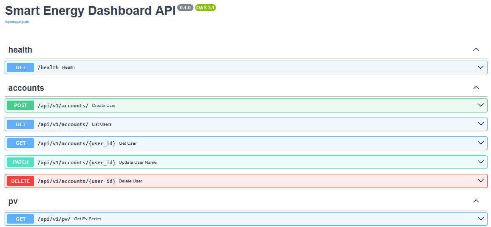

.ve## ⚡ Smart Energy Dashboard — Roadmap & Architecture Overview

This project follows a **monolithic (modular monolith)** architecture built in Python 3.13 with FastAPI, SQLAlchemy, Alembic, and Docker.  
It adheres to the **layered architecture** and **component principles** (ADP, SDP, SAP) from the *Software Architecture/AES* course at AAU Klagenfurt.

### 🧱 Layered Architecture

| Layer | Description | Example Modules |
|-------|--------------|----------------|
| **Presentation** | Handles user and system interaction (API, visualization) | `app/`, `ui/` |
| **Application** | Coordinates use cases and orchestrates domain logic | `modules/accounts/application/` |
| **Domain** | Encapsulates core business logic and entities | `modules/accounts/domain/` |
| **Infrastructure** | Handles persistence, external APIs, and system integration | `platform/`, `modules/*/infrastructure/` |

Each layer depends **inward** (Presentation → Application → Domain → Infrastructure), ensuring **low coupling** and **high cohesion** according to ADP, SDP, and DIP.

---

## 🛠️ Project Milestones

### **Milestone 1 — API Layer & Accounts (CRUD skeleton)**
Implement FastAPI routes for the first domain (`accounts`):
- REST endpoints (`/api/v1/accounts/`)
- DTOs and use cases (`CreateUser`, `ListUsers`)
- Unit and integration tests via Pytest  
🧭 *Applies SRP, DIP, ADP — clear separation between API, application logic, and persistence.*

<Update 2025-10-19>
| Layer                           | Status | Key Design Principle                       |
| ------------------------------- | ------ | ------------------------------------------ |
| **Domain (entities)**           | ✅      | SRP — pure business logic only             |
| **Application (use-cases)**     | ✅      | DIP — depends on ports, not infrastructure |
| **Infrastructure (SQLAlchemy)** | ✅      | ADP — depends inward, implements ports     |
| **API (FastAPI routes)**        | ✅      | SRP + DIP — thin HTTP adapters only        |
| **DB migrations (Alembic)**     | ✅      | version-controlled schema                  |
| **Tests**                       | ✅      | unit + integration pass cleanly            |

# PV Test / mockup 
Under infra/data/pv/pv_2026_hourly.csv we have prepared initial data for PV production for the year 2026 in hourly resolution.
With uvicorn app.main:app --reload one can start the app and open the Swagger UI under http://127.0.0.1:8000/docs
There you'll fine the API endpoint GET /api/v1/pv (default key pv_2026_hourly).
It will return a JSON file for the whole year 2026 (8760 points).

## Comments regarding principles from the lecture notes:
SRP: UI stays thin; CSV loading isolated in infra/pv/repository_csv.py.
DIP: API depends on PVRepositoryPort via the adapter (we can later swap CSV for DB or live API whereas live API is not very likely *G*).
ADP: The dependency arrows point inward (API → modules). Infra implements ports; domain is independent.
---

### **Milestone 2 — Quality Gates (CI, typing, logging, errors)**
Add static analysis, logging, and error management:
- GitHub Actions pipeline (Ruff, Mypy, Pytest)
- Centralized logging and error handling
- Strict type checking (`mypy.ini`)
🧭 *Applies SDP and SAP — stability and abstraction increase toward inner layers.*

---

### **Milestone 3 — Postgres + Docker Compose (DevOps slice)**
Introduce containerized deployment:
- Dockerfile and `docker-compose.yml` (API + Postgres)
- Environment configuration via `.env`
- Alembic migrations executed in container startup  
🧭 *Applies CRP (Common Reuse Principle) and CCP (Common Closure Principle) — deploy related modules together.*

---

### **Milestone 4 — Authentication (JWT) & Demo Readiness**
Add user authentication and secure access:
- User registration and token endpoints (`/auth/register`, `/auth/token`)
- JWT-based authorization and protected routes
- Clean OpenAPI documentation and ready-to-demo instance  
🧭 *Applies OCP and DIP — authentication is extendable and decoupled from domain logic.*

---

### **Milestone 5 — Visualization & Analytics (Streamlit Dashboard)**
Add an interactive, data-driven dashboard for energy insights.

**Goals**
- Implement `ui/dashboard_app.py` using **Streamlit**
- Visualize time series, forecasts, and KPIs (e.g., PV output, storage utilization)
- Communicate with the FastAPI backend via REST or read directly from the database
- Provide dynamic controls (date filters, sliders, charts)  
🧭 *Applies SRP, DIP, SDP — UI focuses purely on visualization while depending on stable API abstractions.*

## 🧭 Project Setup (for collaborators)

### Prerequisites
- Python 3.13.0
- VS Code + Git (I use VScode but should work in Pycharm etc. too)
- Docker Desktop (optional for later, currently it's realized with a local sqlite DB)

### Clone the repository from GitHub to your local machine (i.e. AAU OneDrive)
git clone https://github.com/walter-telsnig/smart-energy-dashboard.git
cd smart-energy-dashboard

### Create a virtual environment
py -3.13 -m venv .venv
.\.venv\Scripts\Activate.ps1

### Install dependencies
pip install -r requirements.txt

### Create local environment file
copy .env.example .env

Inside this .env file you should see:
APP_ENV=dev
DB_URL=sqlite:///./local.db

### Run Alembic migrations
alembic upgrade head

This will create a "local.db" in your local folder.
Later we can/will switch to a docker/postgres DB engine

### Run tests
pytest -q

You should get something like "[100%] 2 passed in X.XXs"

### Run the FastAPI app
uvicorn app.main:create_app --factory --reload --port 8000

Then you should be able to see it under: http://localhost:8000/api/v1/health

### Staying up to date
Before you start to work:
git pull origin main

When done:
git add .
git commit -m "feat: <your changes>"
git push

### Done/Working so far
✅ a functional database (local)
✅ working Alembic migrations
✅ a (more or less) clean monolithic structure
✅ and a reproducible Python environment (if not please feedback)

