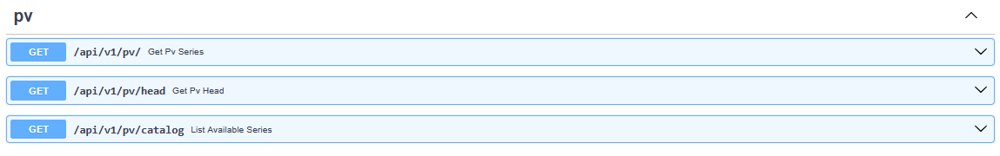

⚡⚡⚡ Smart Energy Dashboard — Roadmap & Architecture Overview⚡⚡⚡

[](https://github.com/walter-telsnig/smart-energy-dashboard/actions/workflows/ci.yml?query=branch%3Amain)

[](https://github.com/walter-telsnig/smart-energy-dashboard/actions/workflows/hello-python.yml)

This project follows a **monolithic (modular monolith)** architecture built in Python 3.13 with FastAPI, SQLAlchemy, Alembic, and Docker.  
It adheres to the **layered architecture** and **component principles** (ADP, SDP, SAP) from the *Software Architecture/AES* course at AAU Klagenfurt.

### 🧱 Layered Architecture

| Layer | Description | Example Modules |
|-------|--------------|----------------|
| **Presentation** | Handles user and system interaction (API, visualization) | `app/`, `ui/` |
| **Application** | Coordinates use cases and orchestrates domain logic | `modules/accounts/application/` |
| **Domain** | Encapsulates core business logic and entities | `modules/accounts/domain/` |
| **Infrastructure** | Handles persistence, external APIs, and system integration | `platform/`, `modules/*/infrastructure/` |

Each layer depends **inward** (Presentation → Application → Domain → Infrastructure), ensuring **low coupling** and **high cohesion** according to ADP, SDP, and DIP.

---

## 🛠️ Project Milestones

### **Milestone 1 — API Layer & Accounts (CRUD skeleton)**
Implement FastAPI routes for the first domain (`accounts`):
- REST endpoints (`/api/v1/accounts/`)
- DTOs and use cases (`CreateUser`, `ListUsers`)
- Unit and integration tests via Pytest  
🧭 *Applies SRP, DIP, ADP — clear separation between API, application logic, and persistence.*

<Update 2025-10-19>
| Layer                           | Status | Key Design Principle                       |
| ------------------------------- | ------ | ------------------------------------------ |
| **Domain (entities)**           | ✅      | SRP — pure business logic only             |
| **Application (use-cases)**     | ✅      | DIP — depends on ports, not infrastructure |
| **Infrastructure (SQLAlchemy)** | ✅      | ADP — depends inward, implements ports     |
| **API (FastAPI routes)**        | ✅      | SRP + DIP — thin HTTP adapters only        |
| **DB migrations (Alembic)**     | ✅      | version-controlled schema                  |
| **Tests**                       | ✅      | unit + integration pass cleanly            |

# PV Test / mockup 
Under infra/data/pv/pv_2026_hourly.csv we have prepared initial data for PV production for the year 2026 in hourly resolution.
With uvicorn app.main:app --reload one can start the app and open the Swagger UI under http://127.0.0.1:8000/docs
There you'll fine the API endpoint GET /api/v1/pv (default key pv_2026_hourly).
It will return a JSON file for the whole year 2026 (8760 points).




## Comments regarding principles from the lecture notes:
- **SRP**: UI stays thin; CSV loading isolated in `infra/pv/repository_csv.py`.
- **DIP**: API depends on `PVRepositoryPort` via the adapter (we can later swap CSV for DB or live API — live API is unlikely).
- **ADP**: The dependency arrows point inward (API → modules). Infra implements ports; domain is independent.
---

### **Milestone 2 — Quality Gates (CI, typing, logging, errors)**
Add static analysis, logging, and error management:
- GitHub Actions pipeline (Ruff, Mypy, Pytest)
- Centralized logging and error handling
- Strict type checking (`mypy.ini`)
🧭 *Applies SDP and SAP — stability and abstraction increase toward inner layers.*

---

### **Milestone 3 — Postgres + Docker Compose (DevOps slice)**
Introduce containerized deployment:
- Dockerfile and `docker-compose.yml` (API + Postgres)
- Environment configuration via `.env`
- Alembic migrations executed in container startup  
🧭 *Applies CRP (Common Reuse Principle) and CCP (Common Closure Principle) — deploy related modules together.*

---

### **Milestone 4 — Authentication (JWT) & Demo Readiness**
Add user authentication and secure access:
- User registration and token endpoints (`/auth/register`, `/auth/token`)
- JWT-based authorization and protected routes
- Clean OpenAPI documentation and ready-to-demo instance  
🧭 *Applies OCP and DIP — authentication is extendable and decoupled from domain logic.*

---

### **Milestone 5 — Visualization & Analytics (Streamlit Dashboard)**
Add an interactive, data-driven dashboard for energy insights.

**Goals**
- Implement `ui/dashboard_app.py` using **Streamlit**
- Visualize time series, forecasts, and KPIs (e.g., PV output, storage utilization)
- Communicate with the FastAPI backend via REST or read directly from the database
- Provide dynamic controls (date filters, sliders, charts)  
🧭 *Applies SRP, DIP, SDP — UI focuses purely on visualization while depending on stable API abstractions.*


## 🧭 Project Setup (for collaborators)

### ⚙️ Prerequisites
- 🐍 **Python 3.13**
- 💻 **VS Code** + Git
- 🐳 **Docker Desktop** *(optional; only needed from Milestone 3 onward)*

---

### 🧩 1️⃣ Clone the repository

git clone https://github.com/walter-telsnig/smart-energy-dashboard.git \
cd smart-energy-dashboard

### 🪶 2️⃣ Create and activate the virtual environment

python -m venv .venv \
.venv\Scripts\Activate.ps1

### 📦 3️⃣ Install dependencies
pip install -U pip \
pip install -r requirements.txt

### ⚙️ 4️⃣ Configure environment
Create a .env file (or copy from .env.example) with:

SED_DB_URL=sqlite:///./dev.db
API_BASE=http://localhost:8000/api/v1

💡 SQLite is used for local development.
Later milestones (M3 +) switch to Postgres via Docker Compose.

### 🚀 5️⃣ Run the API
python -m uvicorn app.main:create_app --factory --reload --port 8000

Check:

✅ Health: http://localhost:8000/health
📘 Docs: http://localhost:8000/docs


### 💡 6️⃣ Run the Streamlit UI
.venv\Scripts\activate \
streamlit run ui/app.py

🌐 UI available at: http://localhost:8501

### 🧪 7️⃣ Run tests
pytest -q
✅ Expected: 5 passed in X.XXs

### 🧭 8️⃣ Run via VS Code

Start either service with F5 using the predefined launch configurations:

▶️ API (Uvicorn, factory)

▶️ UI (Streamlit)

### 🧰 9️⃣ ( Optional ) Run via Docker Compose
docker compose up

Services:

⚙️ API → http://localhost:8000/health
📊 UI → http://localhost:8501


### 🧱 Folder Overview
app/        FastAPI routers & app entrypoint
modules/    Domain logic (e.g., accounts model)
infra/      Database engine/session, CSV data, migrations
core/       Cross-cutting settings, logging, error handling
ui/         Streamlit demo (read-only dashboard)
tests/      Unit + integration tests
docs/       Architecture notes & ADRs

### 🔁 Staying up to date
git pull origin main

And after you changed something:
git add .
git commit -m "feat: <your message>"
git push

---

### 💾 Local development database

By default, the project uses a lightweight **SQLite** database named `dev.db`
stored in the project root.

- It will be **created automatically** when you first start the API.
- You can inspect it using any SQLite viewer (e.g., VS Code “SQLite Viewer” extension).
- It is **not versioned** — it’s ignored by `.gitignore` and safe to delete anytime.
- For a clean start:
  ```powershell
  Remove-Item dev.db


### Docker Tutorial (Sabrina)
______________________________________________________________________________________
Tutorial Docker Postgres (there are just informations about Postgres in Docker): https://www.datacamp.com/tutorial/postgresql-docker


Postgres-Infos are in the docker-compose.yml file.


HOW TO INSTALL the Postgres Docker Container:
1. IMPORTANT: Check if you have pulled the commit with the docker-compose.yml file.
2. Go to where you have save the GitHub repo
3. Open there CMD
4. Use the command docker copose up -d
5. Check if the container is runing with the command docker ps


HOW TO WORK WITH IT:
1. Start container: docker start postgres-db
2. Stop container: docker stop postgres-db


Variations to Query something: \
a. Use PSQL in Command: docker exec -it postgres-db psql -U postgres -d pv-db \
b. Use pgAdmin


HOW TO ADD the server to pgAdmin(In Case my description isn't clearly. It is also described at the tutorial page: https://www.datacamp.com/tutorial/postgresql-docker?dc_referrer=https%3A%2F%2Fwww.google.com%2F#connecting-using-a-gui-tool-manyd):
1. Right Click at Servers
2. Register->Server
3. In General tab, write the name of the server in the field "Name"
4. In Connection, write "localhost" in the field "Host name/address" and the password in field "Password"
5. Click at the Save Button and the Server is connected with pgAdmin


Note: If you add data in the database, please save the queries as SQL file in the GitHub repo. So we have the same data.
