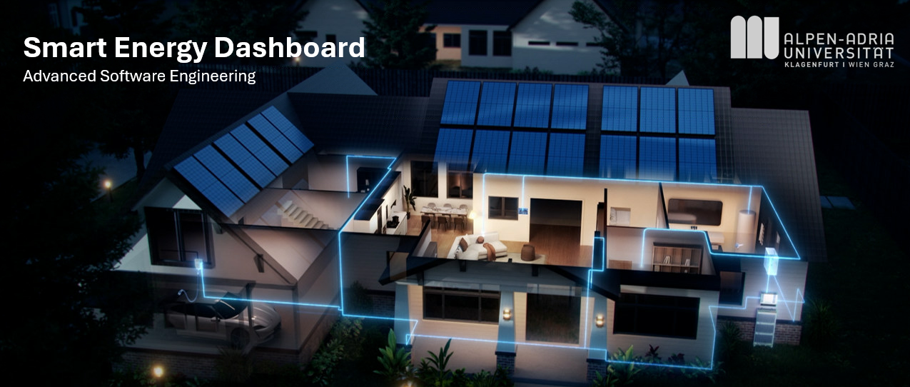

# ⚡ Smart Energy Dashboard

[](https://github.com/walter-telsnig/smart-energy-dashboard/actions/workflows/ci.yml?query=branch%3Amain)
[](https://github.com/walter-telsnig/smart-energy-dashboard/actions/workflows/hello-python.yml)
[](https://sonarcloud.io/summary/new_code?id=walter-telsnig_smart-energy-dashboard)
[](https://sonarcloud.io/summary/new_code?id=walter-telsnig_smart-energy-dashboard)

## 📖 Overview

The **Smart Energy Dashboard** is value-driven application designed to visualize and manage energy data (PV production, consumption, battery storage). It follows a **modular monolith** architecture, leveraging modern Python standards and best practices in software engineering.

**Tech Stack:**
- **Language:** Python 3.13
- **Backend:** FastAPI, SQLAlchemy, Alembic
- **Frontend:** Streamlit
- **Infrastructure:** Docker, Docker Compose
- **Database:** SQLite (Dev), PostgreSQL (Prod)

This project adheres to **layered architecture** and component principles (ADP, SDP, SAP) to ensure maintainability, scalability, and testability.

---

## 🏗️ Architecture

The system is organized into four distinct layers, with dependencies flowing strictly inward (Presentation → Application → Domain → Infrastructure).

| Layer | Description | Key Modules |
|-------|-------------|-------------|
| **Presentation** | Handles user interactions and API endpoints. | `app/`, `ui/` |
| **Application** | Orchestrates use cases and domain logic. | `modules/*/application/` |
| **Domain** | Contains core business entities and logic. | `modules/*/domain/` |
| **Infrastructure** | Manages persistence, external APIs, and system integration. | `infra/`, `modules/*/infrastructure/` |

### Key Design Principles
- **SRP (Single Responsibility Principle):** Strict separation of concerns (e.g., UI vs. Business Logic).
- **DIP (Dependency Inversion Principle):** High-level modules depend on abstractions (ports), not concrete implementations.
- **ADP (Acyclic Dependencies Principle):** No circular dependencies between modules.

---

## 🚀 Getting Started

### Prerequisites
- **Python 3.13+**
- **Git**
- **Docker Desktop** (optional, for milestones 3+)
- **VS Code** (recommended)

### Installation

1.  **Clone the Repository**
    ```powershell
    git clone https://github.com/walter-telsnig/smart-energy-dashboard.git
    cd smart-energy-dashboard
    ```

2.  **Set up Virtual Environment**
    ```powershell
    python -m venv .venv
    .venv\Scripts\Activate.ps1
    ```

3.  **Install Dependencies**
    ```powershell
    pip install -U pip
    pip install -r requirements.txt
    ```

4.  **Configure Environment**
    Create a `.env` file in the project root:
    ```ini
    SED_DB_URL=sqlite:///./dev.db
    API_BASE=http://localhost:8000/api/v1
    ```

### Running the Application

**FastAPI Backend**
 Starts the API server with hot-reload enabled.
```powershell
python -m uvicorn app.main:create_app --factory --reload --port 8000
```
- **Health Check:** [http://localhost:8000/health](http://localhost:8000/health)
- **API Docs:** [http://localhost:8000/docs](http://localhost:8000/docs)

**Streamlit Frontend**
Starts the interactive dashboard.
```powershell
streamlit run ui/app.py
```
- **Dashboard:** [http://localhost:8501](http://localhost:8501)

### 🔐 Authentication & Users

The application uses **JWT Authentication**. You must log in to access the dashboard.

**Default Login:**
There are no default users. You must create one.

**Creating a User:**
Use the helper script to generate a new user account:
```powershell
python scripts/create_user.py <email> <password> "<Full Name>"
```
*Example:*
```powershell
python scripts/create_user.py admin@example.com secret123 "Admin User"
```

### Running Tests
Execute the test suite using Pytest.
```powershell
pytest -q
```

---

## 🐳 Docker Support

To run the application (API + Database) using Docker Compose:

1.  **Start Services**
    ```powershell
    docker compose up -d
    ```

2.  **Verify Status**
    ```powershell
    docker ps
    ```

3.  **Access Services**
    - **PostgreSQL:** Port `5432`
    - **API:** [http://localhost:8000](http://localhost:8000)

**Database Management in Docker:**
- Connect via `psql`: `docker exec -it postgres-db psql -U postgres -d pv-db`
- Connect via **pgAdmin**:
    - **Host:** `localhost`
    - **Port:** `5432`
    - **User/Password:** (See `docker-compose.yml`)


**Note**
If there is a problem with 404 Error, set the ENABLE_DB_ROUTERS to 1


---

## 🗺️ Roadmap & Features

The project development is divided into strategic milestones:

- [x] **Milestone 1: API Layer & Accounts** - Basic CRUD and layered architecture setup.
- [x] **Milestone 2: Quality Gates** - CI pipeline, linting (Ruff), and type checking (Mypy).
- [x] **Milestone 3: DevOps Slice** - Dockerization and Postgres integration.
- [x] **Milestone 4: Authentication** - JWT implementation and secure access.
- [x] **Milestone 5: Visualization** - Advanced analytic dashboard with Streamlit.
